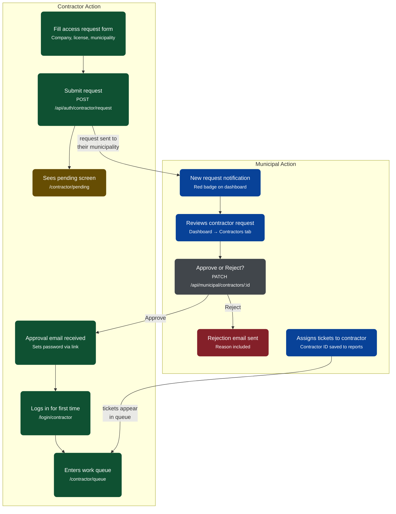

# Road Pulse AI

Road Pulse AI is an intelligent, role-based platform designed to bridge the gap between citizens, municipal authorities, and contractors for efficient road maintenance and infrastructure management. By leveraging predictive insights and strict role-based access control (RBAC), Road Pulse AI streamlines the process from damage reporting to final repair.

## 🚀 Features

### 1. Citizen Portal
- **Gamified Reporting**: Citizens can easily report road damages (potholes, edge failures, etc.) using geo-tagged reports and earn reward points/badges for community contributions.
- **OTP Verification**: Secure passwordless/OTP-based phone and email verification during signup and login.
- **Real-Time Tracking**: Citizens can track the status of their submitted reports.

### 2. Municipal Officer Dashboard
- **Comprehensive Analytics**: Interactive charts (Recharts) displaying predictive insights, damage breakdown by type, and resolution rates.
- **Contractor Management**: A dedicated scorecard evaluating contractors based on SLA compliance, average fix days, and resolution rates.
- **Approval Workflow**: Officers can review, approve, or reject contractor portal access requests directly from the dashboard.
- **Alert System**: Automated alerts for new reports, contractor requests, and SLA breaches.

### 3. Contractor Portal
- **Access Requests**: Contractors can request access by selecting their specific municipality and uploading their license documents.
- **Work Queue (Coming Soon)**: Approved contractors can view their assigned tasks, manage their repair queues, and update ticket statuses.
- **Performance Tracking**: Contractors are graded on their SLA compliance and overall resolution rate.

## 🔄 Contractor Approval Workflow

The following diagram illustrates the complete Role-Based Access Control (RBAC) flow from a contractor requesting access to a municipal officer approving it.



## 🛠 Tech Stack

**Frontend**
- **Framework**: React 18 with Vite
- **Routing**: `@tanstack/react-router`
- **Styling**: Tailwind CSS + Framer Motion for micro-animations
- **Charts**: Recharts
- **State Management**: Zustand (for auth, theme, and notifications)

**Backend**
- **Runtime**: Node.js
- **Framework**: Express.js
- **Database**: MongoDB with Mongoose
- **Authentication**: JSON Web Tokens (JWT) & bcrypt for password hashing
- **Services**: Twilio (SMS OTP) & Nodemailer (Email OTP) mocks/integrations

## 💻 Running the Project Locally

### Prerequisites
- Node.js (v18+)
- MongoDB (running locally on port `27017` or a MongoDB URI)

### Setup

1. **Clone the repository**
   ```bash
   git clone https://github.com/Arshitraj-123/Road-Pulse-AI.git
   cd Road-Pulse-AI
   ```

2. **Install Frontend Dependencies & Start**
   ```bash
   npm install
   npm run dev
   ```
   *The frontend will run on `http://localhost:5173`.*

3. **Install Backend Dependencies & Start**
   ```bash
   cd backend
   npm install
   
   // Create a .env file based on environment variables needed
   // (e.g., PORT=5000, MONGO_URI=mongodb://127.0.0.1:27017/roadpulse, JWT_SECRET, etc.)
   
   npm run dev
   ```
   *The backend will run on `http://localhost:5000`.*

4. **Seed the Database (Optional)**
   You can run the provided seed scripts inside `backend/src/scripts` to populate the database with a default municipal officer, dummy contractors, and sample damage reports to explore the dashboard.

## 🔒 Role-Based Architecture
The application strictly segregates data:
- **Citizens** cannot view municipal dashboards.
- **Municipal Officers** only see data, contractors, and reports mapped to their specific `municipalityId`.
- **Contractors** cannot view other contractors' queues.
- API endpoints are protected using robust JWT verification and role-checking middleware.

---
*Built with ❤️ for better roads.*
